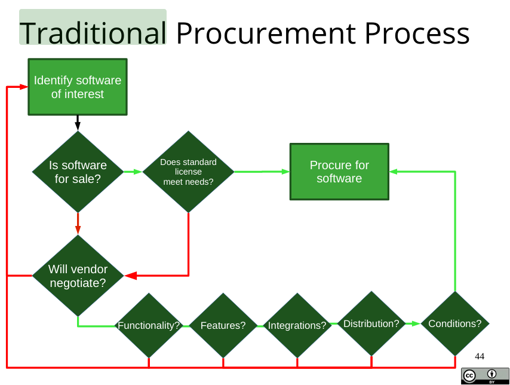

# OSS-test1-cribsheet
Cribsheet for exam 1 of OSS

# Table of contents:

[General Open source and random things](#OSS)

[Git](#Git)

[Documentation](#Documentation)

[Licenses](#Lisence)

[Build Systems](#Build)

# OSS

TODO:

## OSS development

## Random things:

**Regex rules:**


# Git
TODO:

## Some git commands:

**git add:**

**git commit:**

**git pull:**

**git checkout:**

**git branch:**

**git push:**

**git log:**

**git status:**

**git diff:**

**git tag:**

**git rebase:**

**git merge:**


# Documentation
TODO:

## Markdown

**basic markdown**
```
# title
# subtitle

insert picture: 

hyperlink:

list:

1. item 1
2. item 2

```

## Latex

## Github wiki

# License

Open Source and Free Software
---

**OSS License terms apply with distribution not use**

**10 requirements for Open Source:**

1. **Free Redistribution:** no restriction from selling or giving away the software as a component of an aggregate software distribution. License should not require royalty or fee

2. **Source Code:** Source code must be available, not obfuscated, and easy to modify.

3. **Derivative works:** allows for derivative works under the same terms as the origional software

4. **Integrity of the Author's source code:**

5. **No discrimination against persons or groups**

6. **No discrimination against fields or endeavor**

7. **Distribution of License:**

8. **License must not be specific to a product**

9. **License must not restrict other software**

10. **License must be technology-Neutral**

**4 freedoms of Free Software**

  1. Freedom to **run** the program as you with for any purpose
  2. Freedom to **study** how the program works, change it
  3. Freedom to **redistribute** copies to others
  4. Freedom to **distribute modified versions** to others

**Traditional procurement:**



**Open source vs Public domain**

**Open source vs Open Core**

**License and characteristics:**

* **MIT:**
  * characteristics:
    * TODO
  * How it affects project:
    * Use:
    * Creation:
    * Distribution:

* **BSD:**
  * characteristics:
    * TODO
  * How it affects project:
    * Use:
    * Creation:
    * Distribution:

* **GPL:**
  * characteristics:
    * TODO
  * How it affects project:
    * Use:
    * Creation:
    * Distribution:

* **LGPL:**
  * characteristics:
    * TODO
  * How it affects project:
    * Use:
    * Creation:
    * Distribution:

* **AGPL:**
  * characteristics:
    * TODO
  * How it affects project:
    * Use:
    * Creation:
    * Distribution:

* **Mozilla**
  * characteristics:
    * TODO
  * How it affects project:
    * Use:
    * Creation:
    * Distribution:

* **Apache:**
  * characteristics:
    * TODO
  * How it affects project:
    * Use:
    * Creation:
    * Distribution:

# Build Systems

## Compiling Libraries

### Object Files

Object files are an intermediate step in compilation. They are *mostly* machine code, but have additional symbols used by the linker when linking to external libraries.

```bash
cc -c source.c -o object.o
```

### Shared Libraries

Shared libraries are linked **at runtime**

Note: Shared libraries must be compiled as **address independent** objects (`-fPIC`)

```bash
cc -fPIC -c source1.c -o object1.o
cc -fPIC -c source2.c -o object2.o
...
cc -shared -o libshared.so object1.o object2.o ...
cc object.o libshared.so -o binary_out -Wl,-rpath='$ORIGIN'
```


### Static Libraries

Static libraries are linked **at compile time**

```bash
ar qc libstatic.a object1.o object2.o ...
cc object.o libstatic.a -o binary_out
```


## Make

A `Makefile` expresses **targets**, **dependencies**, and **commands**

```makefile
all: hi1 hi2
hi1: hi1.o libhello.so
        cc hi1.o libhello.so -o hi1 -Wl,-rpath='$$ORIGIN'
hi2: hi2.o libhello.so
        cc hi2.o libhello.so -o hi2 -Wl,-rpath='$$ORIGIN'
hi1.o: hi1.c
        cc -c hi1.c -o hi1.o
hi2.o: hi2.c
        cc -c hi2.c -o hi2.o
libhello.so: hello1.o hello2.o
        cc -shared -o libhello.so hello1.o hello2.o
hello1.o: hello1.c
        cc -fPIC -c hello1.c -o hello1.o
hello2.o: hello2.c
        cc -fPIC -c hello2.c -o hello2.o
```

* `all` is a **target**
  * `all` is the default target when the command `make` is ran. I _think_ the `all` target is required for all Makefiles.
* `hi1` and `hi2` are **dependencies** of `all`
  * dependencies can be
    1. targets (eg. `hi1`, `hi2`)
    2. explicitly defined files (eg. `hello1.c`, `hello2.c`)
       - changing an explicitly defined dependency **will** force the target to be rebuilt when `make` is re-ran
    3. implicitly defined files (eg. `hello1.h`, `hello2.h`)
       - changing an implicitly defined dependency **will not** force the target to be rebuilt when `make` is re-ran
* `cc hi1.o libhello.so -o hi1 -Wl,-rpath='$$ORIGIN'` is a **command**


## CMake

CMake is a higher level **abstraction** of `make`, which allows us to generate complex and flexible Makefiles from a relatively simple `CMakeLists.txt`


Example boilerplate `CMakeLists.txt`

```cmake
cmake_minimum_required(VERSION 3.10)

# specify name/version
project(Tutorial VERSION 1.0)

set(CMAKE_CXX_STANDARD 11)
set(CMAKE_CXX_STANDARD_REQUIRED True)

configure_file(TutorialConfig.h.in TutorialConfig.h)
add_executable(Tutorial tutorial.cxx)

target_include_directories(Tutorial PUBLIC
    "${PROJECT_BINARY_DIR}"
    )

```


Here are some examples of high level patterns which can be simplified with CMake


  ### Working with Libraries

```cmake
add_library(library_name [SHARED/STATIC] library.c library.h ...)
add_executable(binary_name, source.c)
target_link_libraries(binary_name, library_name)
```


### Conditionals

```cmake
option(FLAG_NAME "description" [ON/OFF])
if(FLAG_NAME)
	do_stuff()
else()
	do_other_stuff()
endif()
```


### Working with Directories

```cmake
# macro representing the source directory (ie. the one with the CMakeLists.txt)
"${PROJECT_SOURCE_DIR}"
#macro representing the build directory (ie. the one which cmake is run from)
"${PROJECT_BINARY_DIR}"

# include a subdirectory of the directory containing your CMakeLists.txt to the CMake context
add_subdirectory(SubDirectoryName)
```


### Passing Configuration Values Through Headers

```cmake
configure_file(header.h.in header.h)
# tell cmake to add the directory containing header.h.in to our searchpath
target_include_directories(ProjectName PUBLIC
                           DIRECTORY
                           )
```


### Functions/Macros

```cmake
function(function_name arg1 arg2 ...)
	do_stuff()
endfunction(function_name)
```


### Testing

```cmake
enable_testing()

add_test(NAME TestName COMMAND ProgramName Arg1 Arg2 ...)
set_tests_properties(TestName
										PROPERTIES PASS_REGULAR_EXPRESSION "regex"
										)
```


## Regex
Run through this tutorial as a refresher: https://regexone.com/
